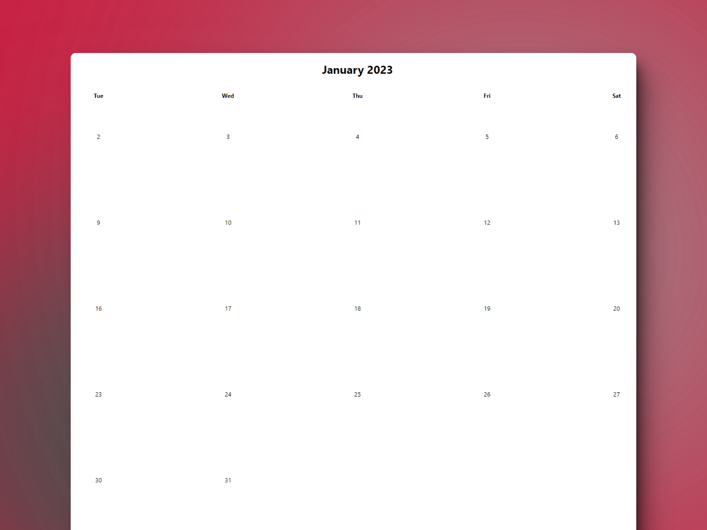

# 📅 HTML, CSS & JavaScript: Calendar i18n

### Calendario con internalización

> 🧩 Aquí puedes ver su [**Live Demo.**](https://calendar-i18n-abraham.netlify.app/)

## 🚀 Descripción

Este es un pequeño calendario hecho de manera vanilla con HTML, CSS y JavaScript.

## 🎭 Tecnologías

El proyecto utiliza las siguientes tecnologías:

- La **API de i18n** con sus funcionalidades
- Renderizado **condicional**, para mostrar los días
- **Event listeners** para el evento Click
